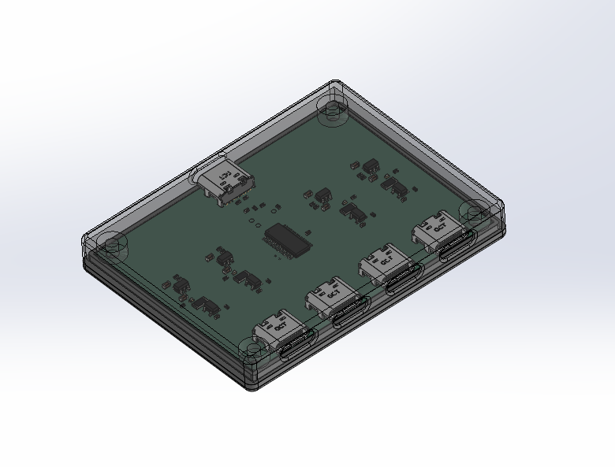
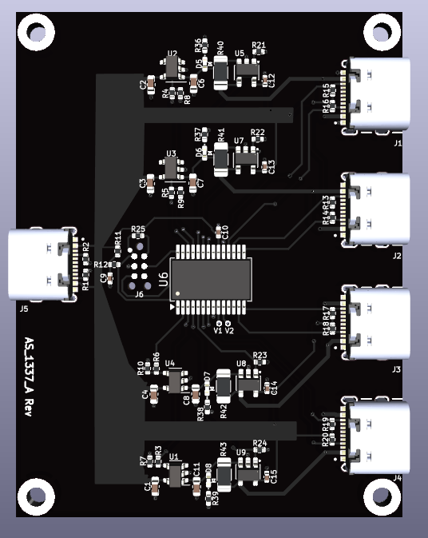
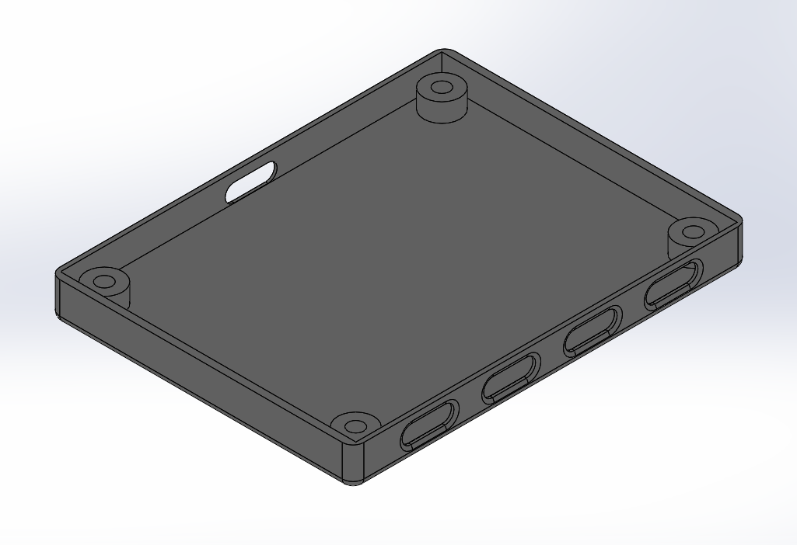
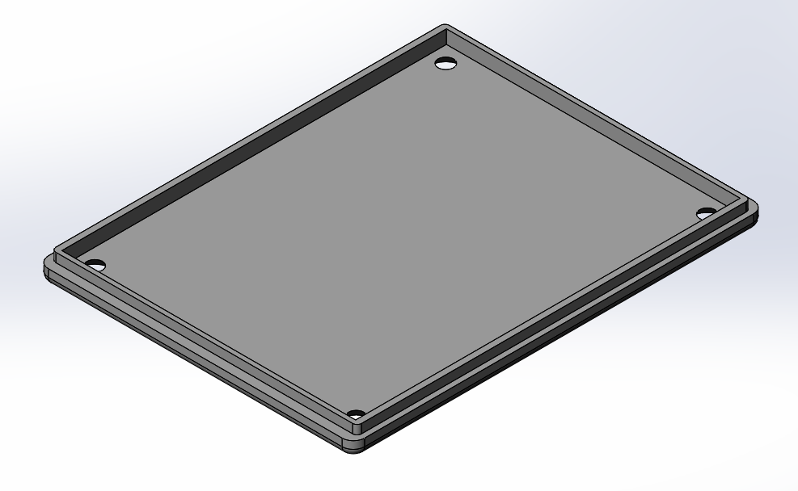

# USB Smart Charger
**4-Port Intelligent Charging System Eliminating Phantom Power Drain**

---

## The Problem

Ever been annoyed in a dark room when a device that is fully charged continously wakes up, flashing LEDs and distrupting your sleep or Netflix show?

**The scenario:**
- You're watching TV or trying to sleep
- Your game controller is "fully charged" but still plugged in
- Every few minutes: bright LEDs flash as the device checks its charge state
- This happens because typical USB chargers provide continuous power, allowing devices to repeatedly check status and consume power even when they are fully charged

**Additional problems with always-on charging:**
- **Phantom power draw:** Even "idle" chargers consume power for status monitoring
- **Battery degradation:** Continuous trickle charging reduces battery lifespan
- **Energy waste:** Charging 4 devices overnight wastes significant power after they're full

---

## The Solution

A truly intelligent 4-port USB charger that **completely cuts power** after charging is complete, eliminating phantom draw, LED flashing, and unnecessary battery wear.

### How It Works

**1. Connection Detection (CC Line Monitoring)**
- Monitors USB-C CC (Configuration Channel) lines to detect device connection
- New device plugged in → power enabled, charging begins

**2. Intelligent Current Monitoring**
- Continuously measures charging current on each port independently
- When current drops below configurable threshold → device is fully charged

**3. Complete Power Cutoff**
- Disconnects power entirely to that port
- **Zero phantom power** - not even status checks
- Device stops all LED, and other activity

**4. Automatic Reset**
- Detects when device is unplugged and reconnected via CC line changes
- Charging cycle restarts automatically

### Key Innovation

Unlike "smart chargers" that reduce current or use timers, this design monitors actual current usage and completely disables current to the charged device.

---

## Features

- **4 independent ports** with individual monitoring and control
- **Zero phantom power** after charging complete
- **Per-port current sensing** with configurable shutoff threshold
- **Automatic reconnection detection** via CC line monitoring
- **Custom enclosure** designed for desktop use
- **Battery health preservation** by eliminating trickle charging

---

## Technical Specifications

**Charging:**
- 4 USB Type-A ports
- Independent current monitoring per port
- Configurable current threshold (10mA typical)
- Total output: 5V and up to 1.5A per each of the 4 ports

**Monitoring:**
- CC line state detection for plug/unplug events
- Automatic port cycling on reconnection

---

## Hardware Design

### PCB Design

*PCB assembly - component placement*

### Enclosure Design

*Custom designed enclosure - top view*

*Enclosure bottom with mounting features*

---

## Design Files

### PCB Design
- **Schematic:** [View PDF](hardware/pcb/Schematic_Final.pdf)
- **BOM:** [View PDF](hardware/pcb/Assembly_Bill_of_Materials.pdf)
- **PCB Render:** [View Image](hardware/pcb/Circuit_Board_Assembly_Top.png)
- **Gerber Files:** Available in `/hardware/pcb/gerbers/` for manufacturing

### Mechanical Design
- **Top Enclosure:** [Download STEP](hardware/mechanical/Enclosure_Top.STEP)
- **Bottom Enclosure:** [Download STEP](hardware/mechanical/Enclosure_Bottom.STEP)

### Firmware
*Microcontroller firmware handles current monitoring, CC line detection, and port control logic*

---

## Use Cases

**Home Entertainment Setup**
- Charge multiple game controllers overnight without LED disturbance
- Eliminate phantom power from chargers left plugged in

**Workspace/Office**
- Charge phones, tablets, headphones during the day
- Automatic shutoff prevents overcharging and conserves energy

**Travel/Hotel**
- Compact design for charging multiple devices
- Battery health preservation for expensive electronics

**Energy Conscious Users**
- Measurable power savings vs. always-on chargers
- Zero standby consumption when devices are charged

---

## Design Approach

**Problem-Driven Engineering:**
This project started from a real annoyance (flashing controller LEDs) and evolved into a comprehensive solution addressing multiple charging inefficiencies.

**Key Technical Decisions:**
- **CC line monitoring** instead of just current sensing enables true plug/unplug detection
- **Complete power cutoff** eliminates all phantom draw
- **Per-port independence** prevents one slow-charging device from affecting others
- **Custom enclosure** provides clean desktop aesthetic

---

## Technical Implementation

**Current Sensing:**
- INA138

**Power Switching:**
- AP2191

**Microcontroller:**
- PIC16F19155
- Handles all monitoring and control logic

---

## Project Status

**Hardware:** ✅ Complete - tested and functional  
**Enclosure:** ✅ Complete - manufactured and assembled  
**Firmware:** 

**Documentation:** ✅ Complete  

---

## Applications & Impact

**Personal Use:**
- Solved the original LED flashing annoyance
- Reduced measurable power consumption in home office
- Extended battery life of frequently charged devices

**Potential Commercial Applications:**
- Hotel rooms (eliminate phantom power, reduce complaints)
- Offices (energy savings across many desks)
- Retail displays (charge demo devices without battery degradation)

---

## Contact

Personal engineering project demonstrating embedded systems design, power electronics, and product development from concept to finished enclosure.

For technical questions or collaboration inquiries, please contact via GitHub.

---

*This project showcases full-stack hardware development: circuit design, PCB layout, firmware development, mechanical enclosure design, and solving real-world user experience problems.*
